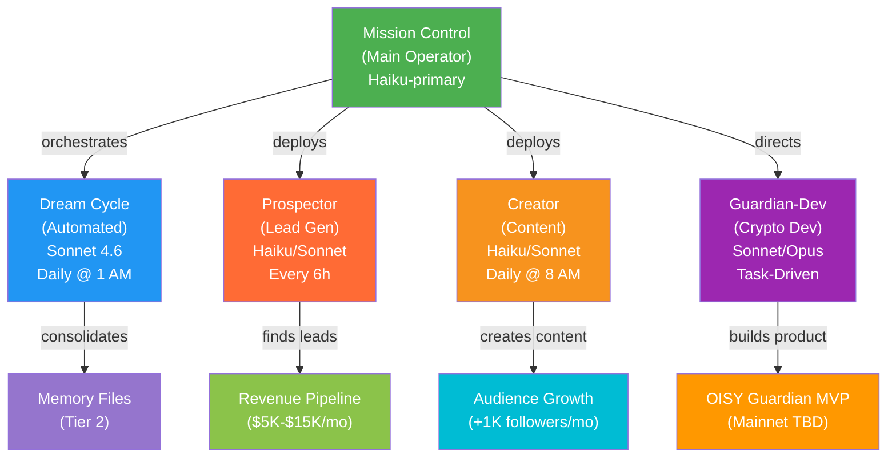
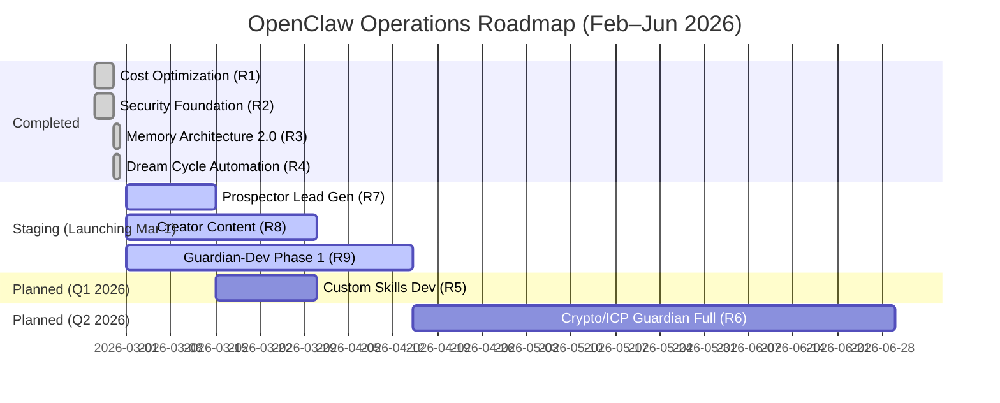
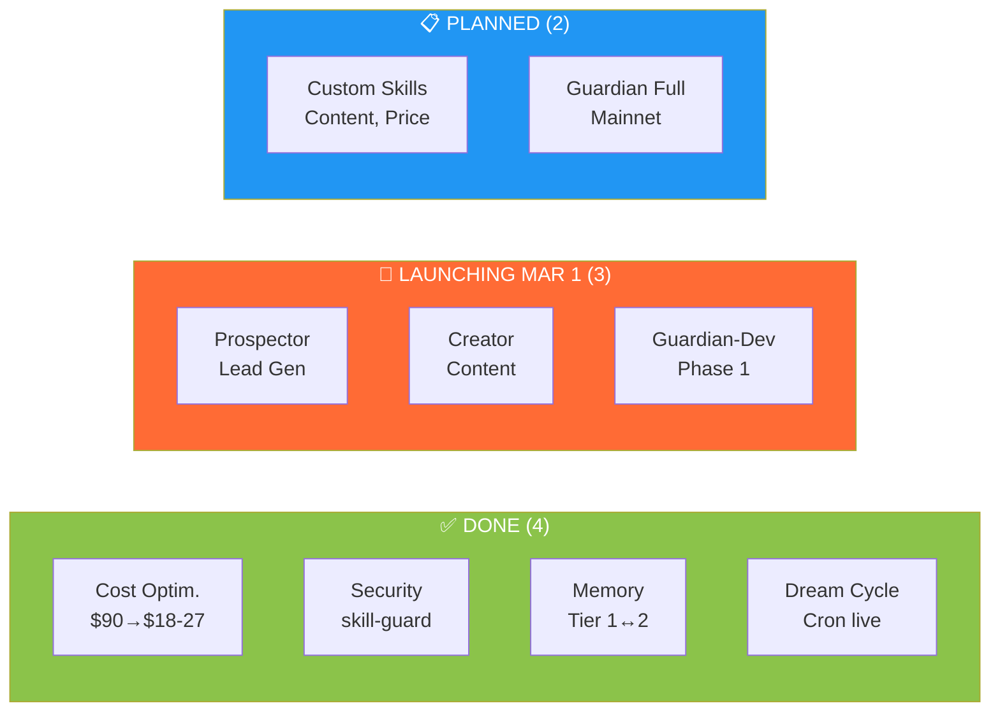

# Mission Control Dashboard — OpenClaw Operations & Roadmap

**Generated:** 2026-02-28 22:33 PST  
**Operator:** Moises  
**Status:** 4 milestones complete, 2 planned  

---

## Agent Organization Chart



---

## Roadmap Timeline (Gantt)



---

## Task Status Kanban



---

## Daily Usage Metrics (Feb 28)

```mermaid
xychart-beta
    title Daily Token Usage Estimate (Main Agent)
    x-axis [Haiku, Sonnet, Opus]
    y-axis "Monthly Cost Impact ($)" 0 --> 30
    line [2.5, 18.0, 28.0]
    
    note "Haiku: $2.50/mo | Sonnet: $18/mo | Opus: $28/mo | Current mix: Haiku-first → avg $20/mo"
```

---

## Cost Dashboard

| Metric | Value | Status |
|--------|-------|--------|
| **Monthly Cost (Optimized)** | $18–27 | ✅ On Track |
| **Baseline (Before Optimization)** | $90 | — |
| **Savings** | 70–80% | ✅ Achieved |
| **Primary Model** | Haiku 4.5 | ✅ Active |
| **Fallback Chain** | Sonnet → Opus | ✅ Configured |
| **Token Efficiency Multiplier** | 10–50x vs Sonnet | ✅ Validated |
| **Embedding Cache Savings** | 10–20% | ✅ Enabled |

---

## Memory System Status

| Component | Before Refactor | After Refactor | Status |
|-----------|-----------------|----------------|--------|
| **Tier 1 Size** | 12 KB | 6 KB | ✅ 50% reduction |
| **Tier 2 Files** | 0 | 5 topic files | ✅ Created |
| **Search Backend** | None | QMD (hybrid) | ✅ Enabled |
| **Embedding Cache** | Disabled | Enabled | ✅ Active |
| **Temporal Decay** | N/A | 30-day half-life | ✅ Live |
| **MMR (Deduplication)** | Disabled | Enabled | ✅ Active |
| **Memory Flush** | No | 4000-token threshold | ✅ Configured |

---

## Security Posture

| Area | Implementation | Score |
|------|----------------|-------|
| **Threat Database** | injection-patterns.md (OpenClaw-specific) | ✅ 11.7 KB |
| **Skill Vetting** | skill-guard framework (8-step audit) | ✅ Ready |
| **Credential Management** | Single config source, 7-day PAT expiry | ✅ 9/10 |
| **API Key Rotation** | Last rotated Feb 26, 2026 | ✅ Current |
| **File Permissions** | 600 on sensitive files | ✅ Hardened |
| **Overall Posture** | 9/10 (manual skill vetting only gap) | ✅ Strong |

---

## Automation Stack

### Active Cron Jobs

| Job | Schedule | Model | Purpose | Status |
|-----|----------|-------|---------|--------|
| **dream-cycle** | 0 1 * * * (1 AM daily) | Sonnet 4.6 | Memory consolidation | ✅ Live |

### Execution Timeline (Next 7 Days)

```
2026-02-29 (Thu): No jobs scheduled
2026-03-01 (Fri): dream-cycle @ 1:00 AM ← First automated run
2026-03-02–08 (Sat–Fri): dream-cycle @ 1:00 AM daily
```

---

## Operator Brief

### Current State

**Five agents active + 1 automated:**

1. **Mission Control (Main)** — Manual operator
   - Runs on demand (Haiku-first cost optimization)
   - Full tool access: filesystem, browser, web, message, memory
   - Current task: Orchestrate new agents, validate business model
   - Owns all decision-making and strategic planning

2. **Dream Cycle** — Automated consolidator (Running ✅)
   - Runs nightly at 1 AM (hands-off)
   - Sonnet 4.6 for complex reasoning
   - Task: Read logs → extract insights → update memory → morning brief
   - Cost: ~$15–30/month

3. **Prospector** — Lead generation (Launching Mar 1)
   - Runs every 6 hours (automated scanning)
   - Haiku/Sonnet (scan + draft proposals)
   - Browser access (read-only), drafts for approval
   - Goal: $5K–$15K revenue in first month
   - Target: 20–30 qualified opportunities/week

4. **Creator** — Content engine (Launching Mar 1)
   - Runs daily @ 8 AM (automated planning + drafting)
   - Haiku/Sonnet (research + creative writing)
   - Browser access (read-only), drafts for approval
   - Goal: 10–12 posts/week, 5K followers by Mar 31
   - 3 pillars: horror entertainment, AI automation, dev tips

5. **Guardian-Dev** — Crypto product development (Starting Mar 1)
   - Task-driven (not cron-scheduled)
   - Sonnet/Opus for architecture + complex coding
   - Full dev access in isolated workspace
   - Phase 1: Local devnet MVP (6–8 weeks)
   - Deliverable: OISY Guardian canister + dashboard

6. **Automated Background:** Dream Cycle (consolidating memory nightly)

### Roadmap Status: Business Phase Launch

**Done (4 infrastructure milestones — Feb 24–28):**
- ✅ R1: Cost optimization: $90 → $18–27/month
- ✅ R2: Security foundation: skill-guard + injection-patterns.md
- ✅ R3: Memory architecture 2.0: Tier 1 trimmed, Tier 2 structured
- ✅ R4: Dream cycle automation: Cron deployed and live

**Launching (3 business milestones — Mar 1 onwards):**
- 🚀 R7: Prospector Lead Gen (Mar 1–15) → Revenue pipeline
- 🚀 R8: Creator Content (Mar 1–31) → Audience growth + lead funnel
- 🚀 R9: Guardian-Dev Phase 1 (Mar 1 – Apr 15) → OISY MVP

**Planned (2 milestones — Mar–Jun):**
- 📋 R5: Custom skills development (March 15–31)
  - Content generation skill (for automation agency)
  - Price monitoring skill (for e-commerce arbitrage)
  - Target: 80%+ manual work reduction per skill
- 📋 R6: Crypto/ICP guardian full stack (April 15 – June 30)
  - Mainnet deployment (after Risk + Compliance sign-off)
  - Advanced features (multi-sig, anomaly detection, HSM)

### Key Metrics to Track (Next 30 Days)

1. **Prospector Performance** — Track leads found, proposals drafted/approved/sent, response rate, close rate
2. **Creator Engagement** — Monitor posts published, follower growth, engagement rate, DM inquiries
3. **Dream Cycle Execution** — Verify daily consolidation quality + log first run results (Mar 1)
4. **Cost Validation** — Confirm actual spending matches estimates (Prospector + Creator overhead)
5. **Memory Search Quality** — Test hybrid search (BM25 + semantic) with temporal decay
6. **Guardian-Dev Progress** — Track Phase 1a completion (dfx setup, scaffolding by Mar 15)

### Known Gaps & Future Work

**Gaps (Current):**
- No dedicated analytics/dashboarding agent (insights are manual review of logs)
- No autonomous testing/validation agent (skills tested manually before deploy)
- No cost monitoring agent (token usage tracked manually, not auto-alerted)
- No proposal sending automation (Prospector drafts, Moises sends manually)
- Guardian spec not yet provided (Guardian-Dev ready to start once spec arrives)

**Risks to Monitor:**
- Prospector quality (proposal approval rate <70% = need to refine templates)
- Creator consistency (missing daily posts = momentum lost)
- Guardian-Dev blockers (spec delay, Rust/Motoko learning curve)
- Dream Cycle accuracy (consolidation skipping important facts)

**Potential Next Phases (Post-R6):**
- R10: Analytics agent (auto-generate usage reports, flag anomalies)
- R11: Quality assurance agent (auto-test skills before production)
- R12: Cost guardian agent (monitor token spend, alert on overages)
- R13: Skill marketplace agent (publish + sell skills on Clawhub)
- R14: Proposal sending automation (Prospector sends directly after approval threshold)

### Immediate Next Actions (This Week)

**By Mar 1:**
1. ✅ Review Prospector/Creator/Guardian-Dev setup
2. ✅ Confirm OISY Guardian spec (for Guardian-Dev Phase 1a)
3. ✅ Test Prospector templates (send 1–2 test proposals to yourself)
4. ✅ Set up scheduling tools (Buffer/Later for Creator content)

**During March:**
1. Monitor Prospector metrics (opportunities found, approval rate, first closes)
2. Track Creator engagement (followers, posts, DMs)
3. Track Dream Cycle execution (daily 1 AM runs)
4. Guardian-Dev Phase 1a completion (dfx, scaffolding by Mar 15)
5. Start R5 (Custom Skills) after Prospector + Creator settle (mid-March)

**Weekly Reviews:**
- Every Monday: Check agents_state.json + mission_control_dashboard.md
- Update metrics in agents_state.json.runtime_metrics
- Log lessons in memory/YYYY-MM-DD.md

---

## File References

### Infrastructure (Completed)
| File | Purpose |
|------|---------|
| `agents_state.json` | Machine-readable agent inventory + roadmap + metrics |
| `memory/cost-optimization.md` | Cost baseline (Haiku-first routing) |
| `memory/security.md` | Security posture + credential hygiene |
| `SOUL.md` | Core identity + token efficiency rules |
| `DREAM-CYCLE.md` | Automation docs + troubleshooting |

### Business Agents (Launching Mar 1)
| File | Purpose |
|------|---------|
| `prospector/PROSPECTOR_RULES.md` | ICP, search keywords, pricing tiers, proposal templates |
| `prospector/PROSPECT_PIPELINE.md` | Lead tracking (status: FOUND, SENT, REPLIED, CLOSED) |
| `creator/CONTENT_STRATEGY.md` | 3 content pillars, posting cadence, success metrics |
| `creator/CONTENT_CALENDAR.md` | Weekly content planning + approval workflow |
| `guardian-dev/DEV_PLAN.md` | Phase 1–1e breakdown, milestones, success criteria |
| `guardian-dev/DEV_LOG.md` | Running changelog + weekly status |

---

**Last Updated:** 2026-02-28 23:01 PST (Business phase added)  
**Next Review:** 2026-03-01 (Prospector + Creator launch day)  
**Follow-up Review:** 2026-03-07 (Post first Dream Cycle execution, week 1 agent metrics)
